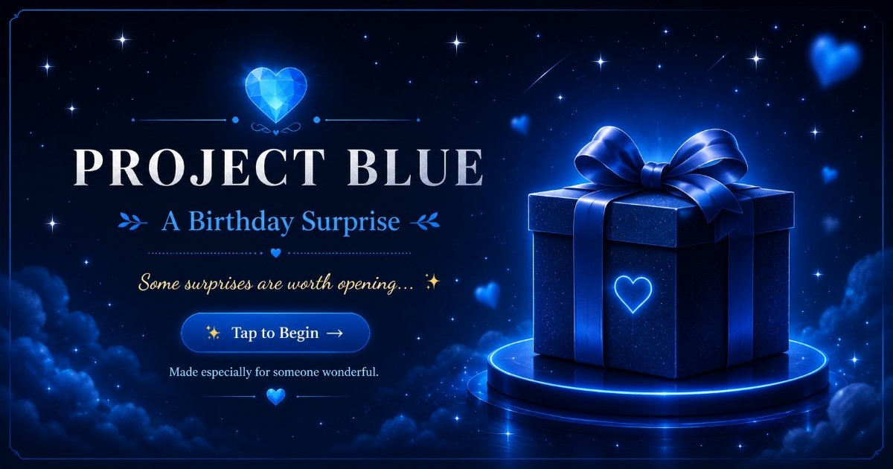

# 🎁 An Interactive Birthday Surprise Website

### Project Blue – A Personalized Birthday Experience



## About the Project

Operation Pranathi is a small birthday surprise website that I created using HTML, CSS, and JavaScript.

Instead of sending a normal birthday message, I wanted to create something more memorable and interactive. The website takes the user through different sections such as a gift reveal, photo reveal, memory cards, a personal letter, a memory jar, a journey timeline, and a celebration screen.

While building this project, I focused on making it visually appealing, smooth to use, and responsive on both desktop and mobile devices.

---

## Live Website

🔗 https://dineshsaikumar05.github.io/Operation-Pranathi/

---

## Features

- Welcome screen with animations
- Interactive gift opening
- Birthday photo reveal
- Memory flip cards
- Personal letter section
- Memory Jar interaction
- Journey timeline
- Award and celebration screens
- Responsive design
- Optimized for smoother performance on mobile

---

## Built With

- HTML5
- CSS3
- JavaScript
- Git & GitHub
- GitHub Pages

---

## Project Structure

```text
Operation-Pranathi/
│
├── assets/
│   └── images/
│
├── preview.jpg
├── preview.png
├── index.html
├── style.css
├── script.js
└── README.md
```

---

## What I Learned

This project taught me a lot beyond writing HTML, CSS, and JavaScript.

Some of the things I learned while building it include:

- Creating responsive layouts
- Improving animation performance
- Optimizing websites for mobile devices
- Using Git and GitHub for version control
- Deploying a website using GitHub Pages
- Debugging and improving user experience

---

## Author

**Dinesh Sai Kumar**

GitHub:
https://github.com/Dineshsaikumar05

---

## Note

This project was created as a personal birthday surprise and for learning purposes.
